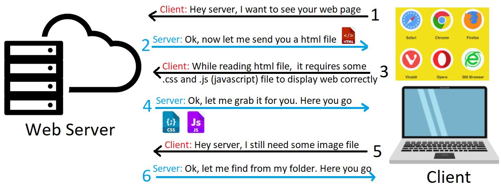

# Server Windows


## Introducere 

<br />

În lumea internetului, există întotdeauna un **server** care poate deservi mai mulți **clienți**. De exemplu, Google, Netflix, Facebook și așa mai departe sunt servere. Oamenii ca noi sunt clienti și acestia pot folosi browsere web (Chrome, Edge, Opera, Firefox, etc.) pentru a comunica cu serverele.

**Serverul web** sau **web server** este serverul care stochează (găzduiește) pagini web și le pune la dispoziția solicitanților prin protocolul HTTP. Și de dată aceasta relația server-client se bazează pe o aplicație care este instalată pe server și care este programată să transfere paginile web găzduite. Putem observa aici că ideea de web server presupune și noțiunea de hosting (găzduire), asta deoarece serverul trebuie să dețină datele pe care urmează să le returneze la cerere.

Relația este următoarea: utilizatorul (clientul) aflat în dreptul unui computer pe care are instalată o aplicație tip browser solicită (serverului) prin intermediul unui url o anumită pagină web; serverul rulează anumite linii de cod și returnează un rezultat. 

Un server web acceptă și îndeplinește solicitările clienților pentru conținut static (adică, pagini HTML, fișiere, imagini și videoclipuri) de pe un site web. Serverele web gestionează numai cererile și răspunsurile HTTP .


<br />


<br />


## Cerinte de sistem

<br />


| Rol  | Cerinte |
| ------------- | ------------- |
| Server  | Sistem de operare Linux/Windows. Mediu de dezvoltare C\C++: Visual Studio.   |
| Client  | Orice sistem de operare (Windows, IOS, Android, Ubuntu) care poate accesa browserul web.  |

<br />

## Functionalitate sistem client-server

<br />

A. **Client**: clientul este utilizatorul care accesează site-ul web de pe dispozitivul său, fie el laptop, desktop, tabletă, smartphone etc. Pentru acces, este nevoie doar de o conexiune la Internet și un browser web, un software foarte important din partea clientului, care este responsabil de afișarea întregului conținut web într-un mod ușor de utilizat și de a permite utilizatorului să interacționeze cu acesta. Și pentru aceasta vom avea nevoie doar de adresa paginii web sau de un IP.

B. **Server**: va conține toate datele și un software care acționează ca un server, adică îi permite clientului să se conecteze pentru a face tot ce trebuie să facă. În cazul unui server web, acesta va fi, de exemplu, Apache, Lighttpd etc.


<br />



<br />


**Serverele web** urmează un model **client-server**. În această structură, un program, cunoscut și sub numele de client, solicită o resursă sau serviciu de la un alt program, server.


<br />
Pentru a procesa cererile clienților web, serverele web urmează câțiva pași:

* Când un utilizator web dorește să încarce conținutul unui site web, browserul său web solicită acces prin internet. Aceasta se numește cerere HTTP.
Browserul web caută adresa IP a site-ului web solicitat traducând adresa URL a paginilor web prin sistemul de nume de domeniu (DNS) sau căutând prin cache-ul acestuia. Acest proces localizează serverul web unde sunt găzduite fișierele site-ului.
* Serverul web primește cererea HTTP și o procesează prin serverul său HTTP. Odată ce serverul său HTTP acceptă cererea, va căuta prin fișierele serverului pentru a obține datele relevante.
* După aceea, serverul web returnează fișierele site-ului browserului web care a trimis solicitarea. Apoi, utilizatorul web vede conținutul site-ului.
<br />

Cu toate acestea, dacă serverul HTTP nu reușește să găsească sau să proceseze fișierele solicitate, acesta răspunde browserului web cu un mesaj de eroare. Una dintre cele mai frecvente este o eroare 404, dar poate apărea și o eroare 403 dacă există probleme de permisiuni.

Pe de altă parte, dacă un server web nu primește un răspuns în timp util de la un alt server care acționează ca proxy sau gateway, apare o eroare 504.

<br />


## Descriere proiect
<br />


Acest proiect arată una dintre modalitățile majore în care sunt implementate serverele HTTP, si anume, folosește un **socket TCP** pentru a asculta cererile primite și trimite înapoi un răspuns HTTP de bază bazat pe standardele stabilite de documentele RFC.

**Serverul** continuă să asculte orice mesaj primit, apoi trebuie să analizăm care sunt informațiile utile din mesaj, parsându-l. Informațiile utile la care ne pasă sunt numele fișierului (cu calea) și extensia fișierului. **Serverul** deschide apoi fișierul conform căii și pune conținutul fișierului într-un mesaj de răspuns pe care îl vom trimite ulterior **clientului**. Înainte de a trimite mesajul de răspuns, ar trebui mai întâi să spunem **clientului** ce tip de conținut de fișier vom trimite, poate fișier imagine (.jpg, .png, ...) sau fișier txt (.html, .doc, . ..) și așa mai departe.
<br />

Mediul de dezvoltare al aplicatiei este **Visual Studio**. Serverele web urmează un model client-server. În această structură, un program, cunoscut și sub numele de client, solicită o resursă sau serviciu de la un alt program, server.

Pentru a comunica între software-ul de rețea Windows și serviciile de rețea, voi folosi fisierul header: #include <WS2tcpip.h>. Fișierul antet **Ws2tcpip.h** conține definiții introduse în documentul WinSock 2 Protocol-Specific pentru TCP/IP, care include funcții și structuri mai noi utilizate pentru a prelua adrese IP. (Winsock permite programelor și aplicațiilor Windows să se conecteze la internet prin TCP/IP).

Serverul va avea un socket TCP care:

1.	ascultă cererile primite pe o anumită adresă de socket (care este în mare parte o combinație între o adresă IP și un port de rețea).
2.	procesează sincron conexiunile de rețea dintr-o coadă de fire de execuție (din ce a ascultat) (acceptă o conexiune de rețea din coadă pe rând).
3.	citește mesajul trimis de un client prin conexiunea la rețea și trimite un răspuns catre client prin conexiunea la retea.

<br />

### 1. ascultă cererile primite pe o anumită adresă de socket 

<br />

Voi avea o clasa TCPListen ce va contine:
- **un constructor ce va primi ca parametri adresa ip si portul**

```c++
TCPListen(const char* ipAddress, int port) :
		adresaIP(ipAddress), portul(port) { } 
```

- **functia init():**
  - *creare socket*
  ```c++
	socketul = socket(AF_INET, SOCK_STREAM, 0);
	if (socketul == INVALID_SOCKET)
	{
		return WSAGetLastError();
	} 
  ```
  - *Structura „sockaddr_in” este foarte frecvent utilizată în programarea socketului în limbajul de programare C. Această structură vă permite să legați un socket cu adresa dorită, astfel încât un server să poată asculta cererile de conectare ale clienților.*
  ```c++
	sockaddr_in adr;
	adr.sin_family = AF_INET;
	adr.sin_port = htons(portul);
	inet_pton(AF_INET, adresaIP, &adr.sin_addr);

	if (bind(socketul, (sockaddr*)&adr, sizeof(adr)) == SOCKET_ERROR)
	{
		return WSAGetLastError();
	}
  ```
  
  - *listen pentru solicitarile de conectare primite pe socketul creat*
  ```c++
	if (listen(socketul, SOMAXCONN) == SOCKET_ERROR)
	{
		return WSAGetLastError();
	}
  ```
  - *creare file descriptor, initializat cu 0, adaugam socketul de ascultare pentru a putea intercepta conexiunea*
  ```c++
  FD_ZERO(&filedescriptorul);
  FD_SET(socketul, &filedescriptorul);
  ```


- **functia run():**

  - se va crea o copie a setului de file descriptori ai fisierului principal. Copia contine socket-urile care accepta cereri de conexiune de intrare sau mesaje. De exemplu, avem un server si setul de descriptori al fisierului principal, care contine 5 item-uri: socket-ul de ascultare si patru clienti. Cand se ajunge in select(), sunt returnate doar socket-urile care interactioneaza cu serverul.  
  
  <br />

  ```c++
  	bool running = true;
	
	while (running)
	{

		fd_set copie = filedescriptorul;

		int socketCount = select(0, &copie, nullptr, nullptr, nullptr);

		for (int i = 0; i < socketCount; i++)
		{
			SOCKET sock = copie.fd_array[i];

			if (sock == socketul)
			{

				SOCKET client = accept(socketul, nullptr, nullptr);
				FD_SET(client, &filedescriptorul);
				onClientConnected(client);
			}
			else 
			{
				char buf[4096];
				ZeroMemory(buf, 4096);


				int bytesIn = recv(sock, buf, 4096, 0);
				if (bytesIn <= 0)
				{
					onClientDisconnected(sock);
					closesocket(sock);
					FD_CLR(sock, &filedescriptorul);
				}
				else
				{
					onMessageReceived(sock, buf, bytesIn);
				}
			}
		}
	}
  ```


<br />


